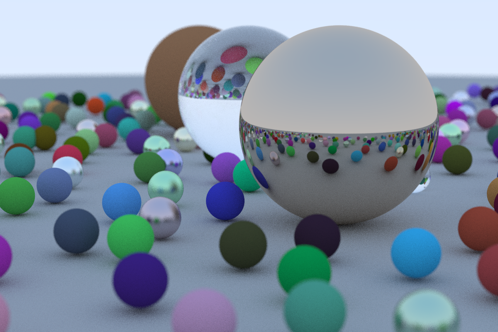

# Ray Tracing In A Weekend

See <https://raytracing.github.io/books/RayTracingInOneWeekend.html> ... this is simply my "Code-along" (in TypeScript)

... took 375min to render with 50 samples ... lots of optimization potential :)
